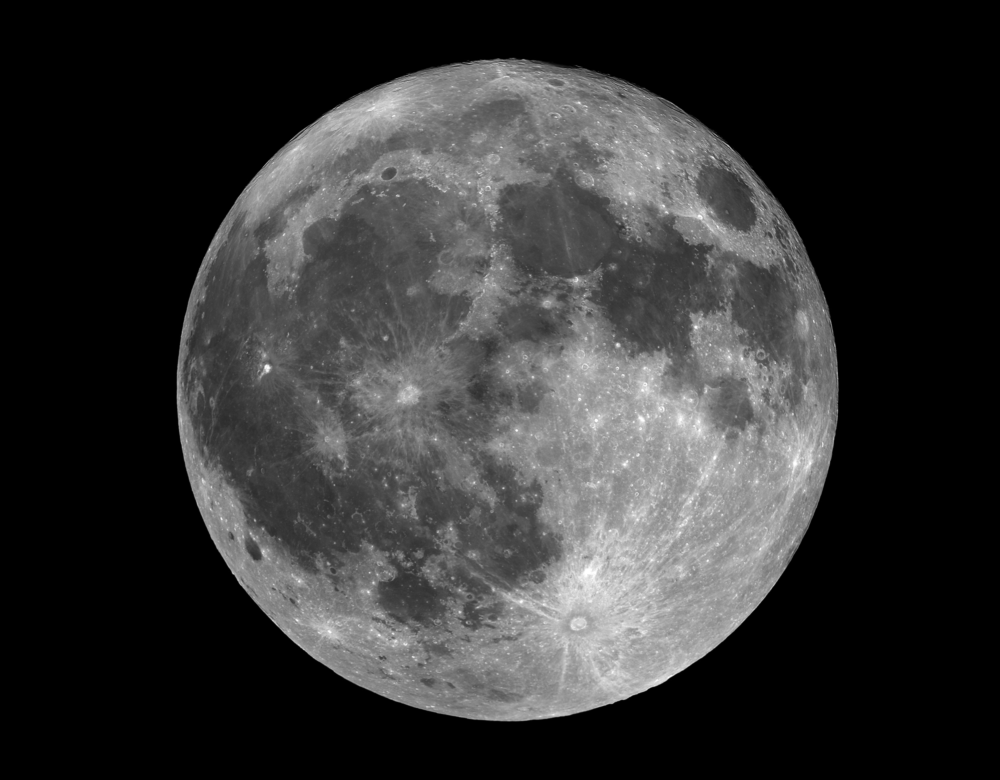
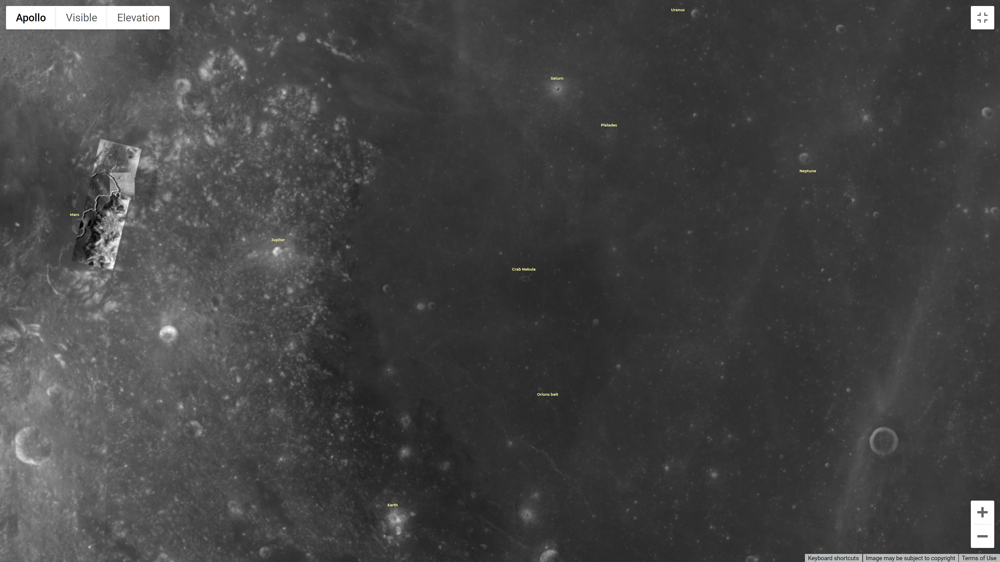
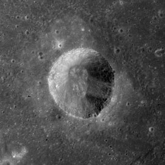
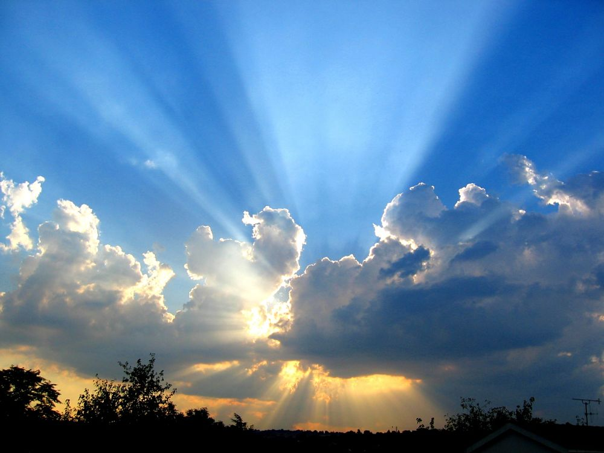
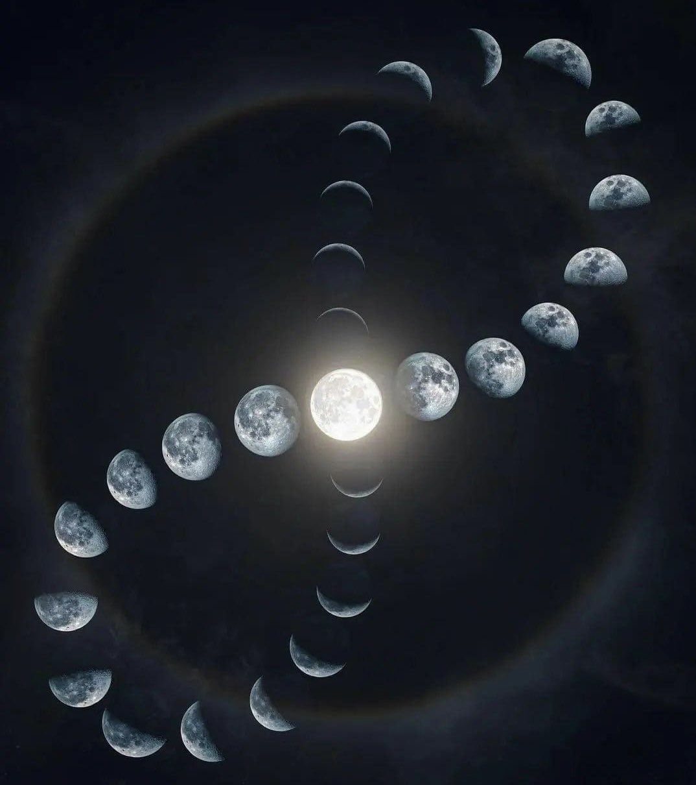
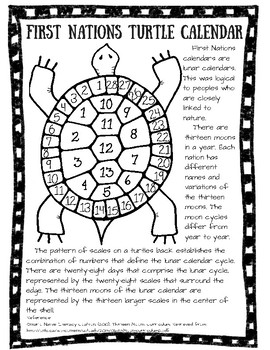
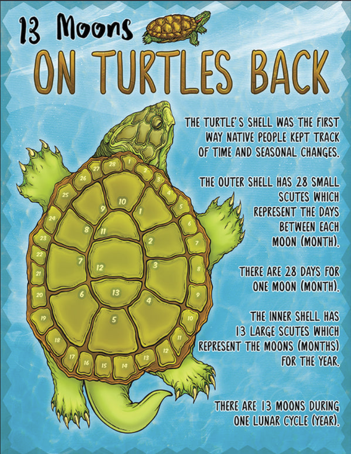
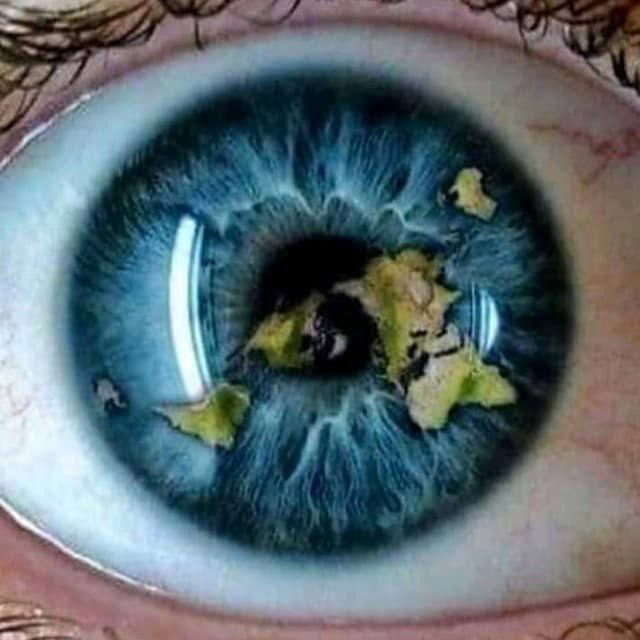

# 🌕 The Moon is Obviously our Reflection

## The Moon is an absolute miracle. It's actually three reflections in one. Allow me to explain each one of the reflections one at a time. 

## 1. Is the visual spectrum reflection. 
## 2. Is the topographical reflection.
## 3. Is the reflection of its own eminence against the larger Earth, shining up onto the night sky. Which is why the stars look like they're water because they're reflections of water on the larger Earth reflecting up onto the night's sky. To visually prove this, we'd have to sit together so we could have the same perspective as it's the widest perspective view we can see.

## Let's start with the basics. When you walk in the bathroom and look in the mirror, you can only look at the front of your face. You can't look at the back of your head cause you're looking at a reflection. We can also agree that your right and left eye are on the wrong sides if looking at you face to face.

## Let's look at logic here. We can't look at the backside of the moon either, you should come to the logical conclusion that it is also a reflection. Allow me to prove it.

## 1. The visual spectrum reflection (inside our crater - closest reflection)

## Here is an image of the moon just as we look at it in the night sky.

****

## Just as with our reflection in the mirror, we have to "mirror" the image in order to make the image look in correct orientation.

## For this image I have mirrored it and rotated it 45 degrees CCW so there's no mistaking it perfectly lines up with the image coming up after this one.

****

## The next two images come compliments of Vibes of the Cosmos. It clearly shows that the moon is our reflection. Thanks VOC, your level of detail in your book, it is amazing.

****

## Here's a little bit of a close-up for you.

****

# 2. The Topographical Reflection (The Larger Earth Revealed - further point of perspective reflection)

## Visual reflection is one thing, but topographical reflection is completely another. Having said that, I know that I don't know. So this is just my best guess. I know that there are two energy sources involved, so it could be either some sort of an X-ray topographical map into plasma (which the moon may be made of). I'm not quite sure. I'm still trying to wrap my head around it.

## So if we start off by taking very high resolutions of the moon, thank you Google Moon, and we start with the assumption that this is our reflection. Then we start laying the night sky over top of it, and we start triangulating our position until we come to the logical conclusion that we are inside the crater called Salpicuous Gallus M.

****

## This image here shows that you can lay this night sky over top of the moon. Keep in mind though everything around us is always spinning. We're standing still everything around us is always spinning, so the image is constantly changing. You have to keep that in mind.

****

****

## Let's show a little bit more proof. Have a look at this picture and tell me how it's possible that there are clouds further away than the sun is, which is clearly visible in this picture.

****

## Have a close look at this image. It clearly shows the twenty-eight days in a lunar cycle. Which would be very logical if you needed to come up with a calendar.

****

## I also find it very strange that all the natives use the turtle as their calendar. Being a male, I'm not quite sure, but I could swear that the female body runs on a twenty-eight day cycle.

****

## The Year consists of Thirteen months of twenty-eight days and one day of rest.

****

# Eye will end with this, until I continue to peel the onion back further...

****

# Now you can call me crazy, but there once was a guy named Noah who everyone else called crazy as well, until the day it started raining.

## Which will tie into the next data drop, MARS our original home until it's atmosphere was destroyed and they had to move to the next closet crater, Sulpicius Gallus M - aka Earth
